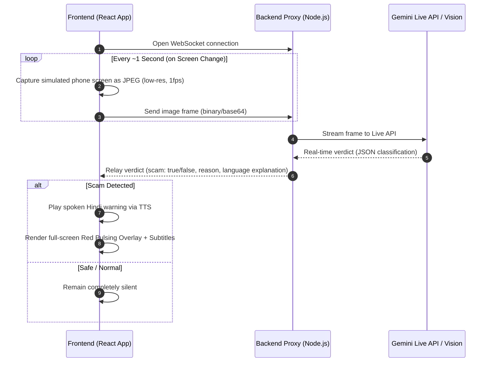

# Rakshak — Design & Architecture Document

Rakshak is a real-time, proactive on-screen guardian designed to protect UPI users (especially elderly, rural, and first-time users) from scams. It operates silently in the background, analyzing screen frames to detect intent-vs-action mismatches, and intervenes with visual overlays and spoken warnings (in Hindi) the instant a scam is detected.

---

## 1. Architectural Overview

The application is split into a **Frontend Client** (simulating a mobile device and UPI app) and a **Backend Proxy Server** (securing the Gemini API key and handling high-performance communication).



---

## 2. Coding and Documenting Guidelines

To maintain code hygiene and satisfy all project constraints, we enforce the following guidelines across the entire codebase:

* **File per Feature**: We split the codebase into single-purpose files rather than monolithic structures. For example, logging is in `logger.js`, config in `config.js`, and scam detection logic is isolated.
* **Docstrings**: Every single function must have a clear, descriptive docstring explaining its input parameters, return values, and behavior.
* **Header Comments**: Every file must start with a comprehensive, multi-line comment block explaining the feature, use cases, and design rationale in detail.
* **Comprehensive Central Config**: All configuration parameters (ports, API endpoints, model names, frame rates) are grouped in centralized files (`config.js` for backend, `config.ts` for frontend).
* **Logging Compliance**: 
  * All function calls are logged as `INFO` with their arguments.
  * All Gemini API inputs (model, prompt, config, frames) and outputs are logged in detail, while stripping out raw binary/inline frame data to keep logs clean and readable.
* **Non-destructive Testing**: We provide dedicated test scripts (e.g., `test_gemini.js`) that mock screen states to test the classification rules without making modifying database/state calls.

---

## 3. Scam Detection Rules (System Prompt Logic)

The core reasoning engine identifies a transaction as a scam based on the **intent-vs-action mismatch**:

```
                                  [ Screen Content Analysis ]
                                               |
                     +-------------------------+-------------------------+
                     |                                                   |
         [ User clearly intends to pay ]                 [ User was told they will RECEIVE ]
                     |                                                   |
         (e.g. scanned merchant QR,                      (e.g. "claim refund", "cashback",
          split rent with contact)                        "prize won", "PIN to verify")
                     |                                                   |
                     v                                                   v
               [ DEBIT OK ]                                        [ DEBIT WARNING ]
                     |                                                   |
                     v                                                   v
                * SILENT *                                     * PROACTIVE WARNING *
```

### Detection Matrix

| Scenario Type | User Action / Context | Screen State | Action |
| :--- | :--- | :--- | :--- |
| **Legit** | Scans QR, pays merchant | UPI PIN entry screen | **SILENT** |
| **Legit** | Sends money to friend | UPI PIN entry screen | **SILENT** |
| **Scam** | Told: "Enter PIN to receive refund" | UPI PIN entry, refund text | **WARN (Hindi)** |
| **Scam** | Told: "Verify account with ₹1 payment" | Fake customer service text | **WARN (Hindi)** |
| **Scam** | Unsolicited collect request from stranger | Urgent "pay now" button | **CLARIFY (Soft caution)** |

---

## 4. The 4 Demo Beats

The application will be validated using an interactive interface representing these four beats:

1. **Beat 1 (Normal Chat/Home)**: No payment context. Rakshak remains completely silent.
2. **Beat 2 (Classic UPI Scam)**: A fake "receive money" screen asks the user to enter their PIN. Rakshak interrupts instantly in Hindi, explaining that "PIN is only for sending money, never receiving."
3. **Beat 3 (Novel Scam Wording)**: A customized, unseen scam scenario (e.g., "Verification fee for a lottery prize"). Rakshak's zero-shot reasoning detects the deception and warns the user.
4. **Beat 4 (Legit payment)**: The user initiates a transfer to a landlord or scans a store QR. Rakshak remains quiet, avoiding false-positive fatigue.
