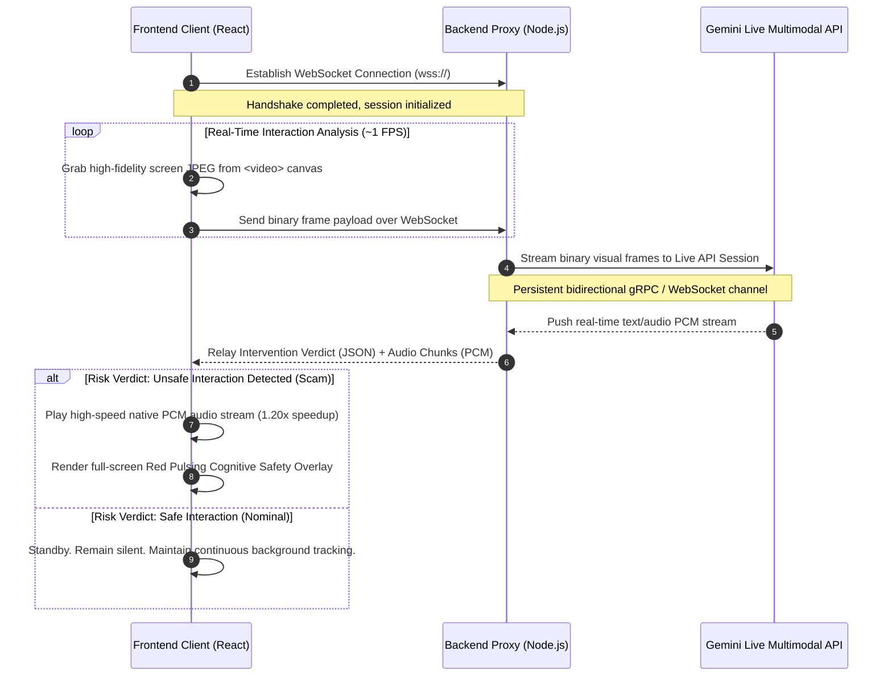

# Rakshak — Technical Architecture Document

This document provides a comprehensive technical overview of the Rakshak Proactive AI Intervention Engine, detailing its real-time streaming protocol, system components, backend-to-frontend interfaces, decision logic, and testing frameworks.

---

## 1. System Topology

Rakshak is built on a high-throughput, low-latency architecture designed to continuously monitor client-side interactions and stream high-speed, localized verbal notifications.



---

## 2. Component Architecture

### 2.1. Frontend Client (React)
*   **Audio PCM Queue Player**: High-speed, low-overhead Web Audio API player which queues 24kHz PCM chunks on the fly. Plays back at `1.20x` speed with seamless cross-fading to prevent lag.
*   **Screen Grab Loop**: Offscreen canvas capturing the local mobile simulator frame at `1.0 FPS`, converting to lightweight JPEGs, and checking if the visual content changed before sending (to conserve bandwidth).
*   **Cognitive Safety Hub UI**: A sleek Light CSOC dashboard utilizing vanilla CSS with glassmorphic cards, sidebar standing panels, and responsive grid layouts.

### 2.2. Backend Proxy (Node.js)
*   **WebSocket Handler**: Manages persistent frontend client connections, safely storing the Google Gemini API key as a server environment variable.
*   **Gemini Live API Client**: Establishes a persistent bidirectional connection using the latest `gemini-2.0-flash-exp` model, passing the multimodal system instructions.
*   **Dialogue Shield Pipeline**: Orchestrates bilingual translation (Hindi / English / Kannada / Telugu) of the intervention dialog.

---

## 3. Cognitive Safety Decision Logic

The core reasoning engine determines interaction safety based on **intent-vs-action mismatch**.

```
                                  [ Screen Content Analysis ]
                                               |
                     +-------------------------+-------------------------+
                     |                                                   |
         [ User clearly intends to pay ]                 [ User was told they will RECEIVE ]
                     |                                                   |
         (e.g. scanned merchant QR,                      (e.g. "claim refund", "cashback",
          split rent with contact)                        "prize won", "PIN to verify")
                     |                                                   |
                     v                                                   v
               [ DEBIT OK ]                                        [ DEBIT WARNING ]
                     |                                                   |
                     v                                                   v
                 * SILENT *                                     * PROACTIVE WARNING *
```

### Risk Evaluation Matrix

| Scenario Class | UI State Context | Threat Vectors | Intervention Trigger | Verbal Warning Message |
| :--- | :--- | :--- | :--- | :--- |
| **Legit Payment** | Scan store QR to pay | Intends to debit account | **None (Silent)** | None (Standby) |
| **UPI Refund Trap** | "Enter UPI PIN to verify refund receipt" | Payment screen disguised as credit | **Immediate Overlay** | "चेतावनी! यूपीआई पिन सिर्फ पैसे भेजने के लिए होता है, प्राप्त करने के लिए नहीं।" |
| **Deceptive Support** | "Install support app & transfer safety fee" | Social engineering support fraud | **Immediate Overlay** | "सावधान! यह एक फर्जी सहायता केंद्र है। पैसे ट्रांसफर न करें।" |
| **Phishing / Collect** | Unsolicited collect request from stranger | Aggressive dark patterns | **Immediate Overlay** | "रुकिए! यह एक अनजान भुगतान अनुरोध है। कृपया इसे अस्वीकार करें।" |

---

## 4. Software Hygiene Guidelines

*   **File per Feature**: Maintain strict separation of concerns. Do not build monolithic scripts.
*   **Comprehensive Central Config**: All constants, hostnames, ports, and model parameters must exist in `config.js` (backend) and `config.ts` (frontend).
*   **Rich Logging Compliance**: Ensure every function logs its calls, arguments, and outcomes as `INFO`, `WARN`, or `ERROR` while stripping large binary components.
